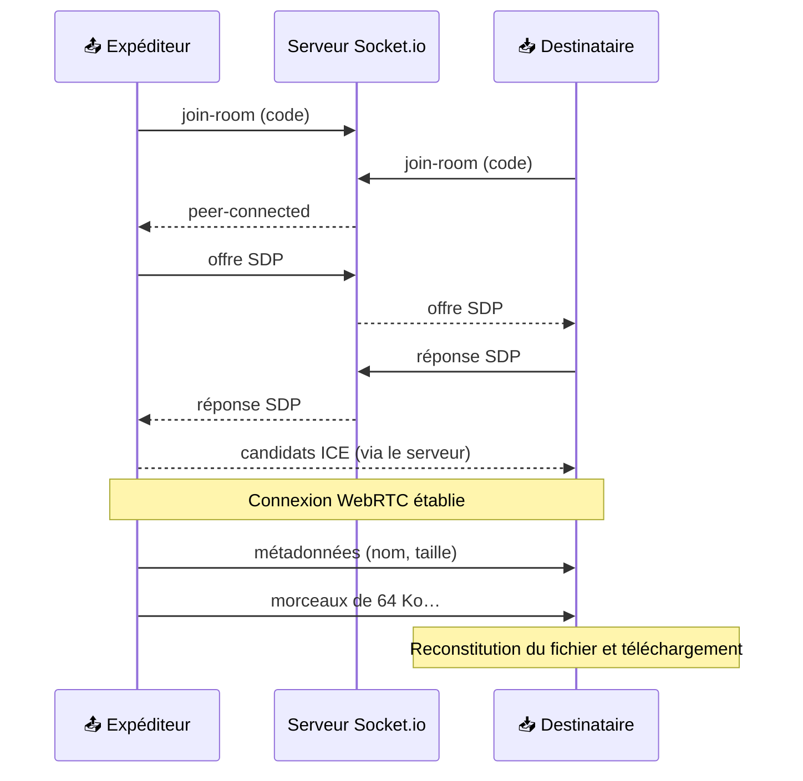

<div align="center">

# 🚀 OsaDrop

**Envoie un fichier d'un appareil à l'autre avec un simple code.<br />Directement, en pair-à-pair : rien n'est stocké sur un serveur.**

<a href="https://osadrop.osalabs.fr"></a>


</div>

<br />

## ✨ En deux secondes

1. **Sur l'appareil qui envoie**, clique sur *Envoyer un fichier* : OsaDrop affiche un **code à 6 caractères** et un **QR code**.
2. **Sur l'appareil qui reçoit**, tape le code ou **scanne le QR code** avec la caméra.
3. La connexion pair-à-pair s'établit. Glisse ton fichier, il arrive de l'autre côté et se télécharge tout seul.

Pas de compte, pas d'appli à installer, pas de fichier qui traîne sur un serveur.

## 🧩 Fonctionnalités

- 🔗 **Salon à code** : 6 caractères, ou un QR code qui pointe vers `osadrop.osalabs.fr/?code=…`.
- 📷 **Scanner intégré** pour rejoindre depuis un téléphone sans rien taper.
- ⚡ **Transfert direct** via un DataChannel WebRTC : le fichier ne passe jamais par le serveur.
- 📦 **Envoi par morceaux de 64 Ko** avec contrôle du débit (`bufferedAmount`), pour ne pas saturer le canal sur les gros fichiers.
- 📊 **Barre de progression** en temps réel, côté envoi comme côté réception.
- 🔒 **Salons à deux** : un troisième appareil qui tente de rejoindre est refusé.
- 🍎 **Compatible OsaNotch** : l'app macOS embarque le même moteur et peut envoyer ou recevoir avec le site.

## 🛠️ Comment ça marche

Le serveur ne sert qu'à **présenter les deux appareils** (la signalisation). Une fois qu'ils se connaissent, ils se parlent directement.



| Couche | Rôle |
|---|---|
| `src/app/page.tsx` | Interface (Next.js + React), logique WebRTC, envoi par morceaux, scanner QR |
| `server.js` | Serveur HTTP custom : sert Next.js et relaie la signalisation Socket.io (`join-room`, `offer`, `answer`, `ice-candidate`) |
| `public/osanotch-bridge.html` | Pont pour l'app native OsaNotch, pilotée via `window.osaBridge` |
| `deploy_osadrop.sh` | Déploiement sur un VPS : PM2 + reverse proxy Nginx |

## 💻 Lancer en local

```bash
git clone https://github.com/osayanis/osadrop.git
cd osadrop
npm install
npm run dev        # http://localhost:3002
```

Pour tester un vrai transfert, ouvre le site sur deux onglets ou deux appareils du même réseau.

> [!NOTE]
> Le scanner QR utilise la caméra, que les navigateurs n'autorisent qu'en **HTTPS** (ou sur `localhost`).

## 🚢 Déployer

```bash
npm run build
npm start          # NODE_ENV=production, port 3002 (ou $PORT)
```

Le script `deploy_osadrop.sh` fait tout sur un serveur Linux : clone, build, lancement avec **PM2** et configuration **Nginx** avec la mise à niveau WebSocket nécessaire à Socket.io. Ajoute ensuite un certificat (par exemple avec Certbot) pour passer en HTTPS.

## 🧭 Limites connues et suite

- Seul un serveur **STUN** est configuré : derrière certains réseaux d'entreprise ou NAT stricts, la connexion directe peut échouer. Un serveur **TURN** réglerait ça.
- Le destinataire reconstitue le fichier **en mémoire** avant de le télécharger : il n'y a pas de limite côté serveur, mais la RAM de l'appareil fixe la limite pratique.
- Idées pour la suite : plusieurs fichiers à la fois, reprise d'un transfert interrompu, écriture en flux sur le disque.

## 🌐 L'écosystème OsaLabs

| | App | |
|:-:|---|---|
| 🎉 | [**OsaParty**](https://osaparty.osalabs.fr) | Écoute de musique synchronisée entre amis |
| 🚀 | **OsaDrop** | Transfert de fichiers P2P |
| 📺 | [**OsaCast**](https://osacast.osalabs.fr) | Partage d'écran instantané |
| 🎨 | [**OsaBoard**](https://osaboard.osalabs.fr) | Tableau blanc collaboratif |
| 👻 | [**OsaNotch**](https://github.com/osayanis/osanotch-native) | L'encoche du Mac devient un compagnon, avec OsaDrop intégré |

<div align="center">
<br />
<sub>Fait par <a href="https://github.com/osayanis">Yanis</a> · <a href="https://osalabs.fr">osalabs.fr</a></sub>
</div>
